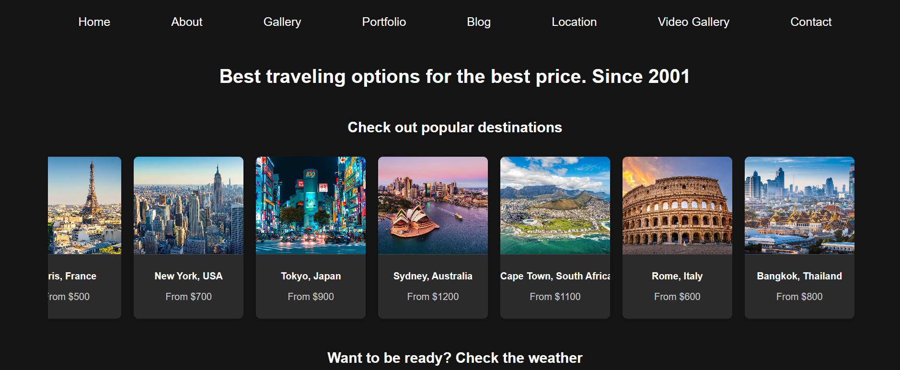
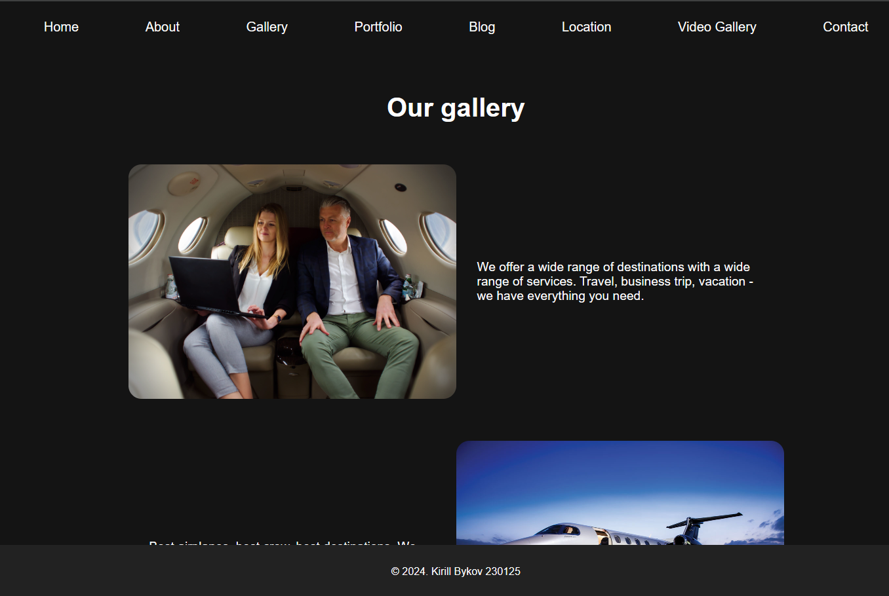
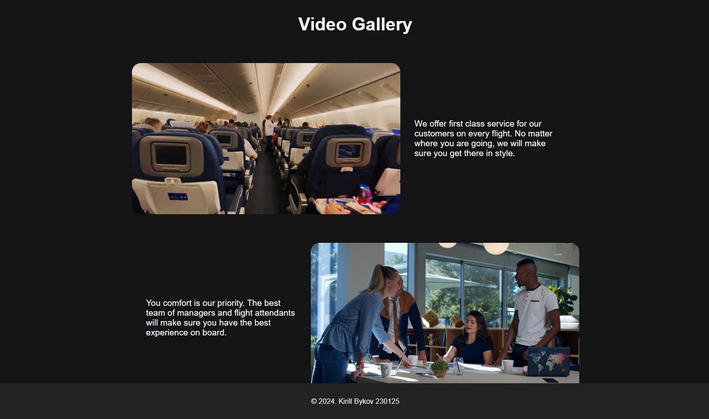
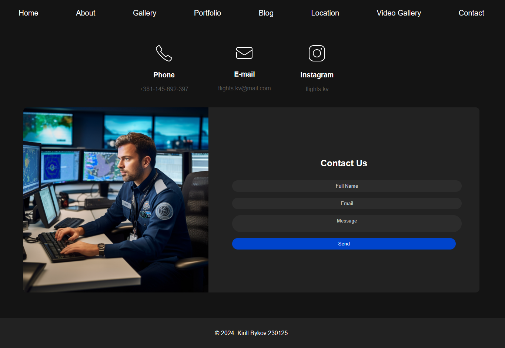
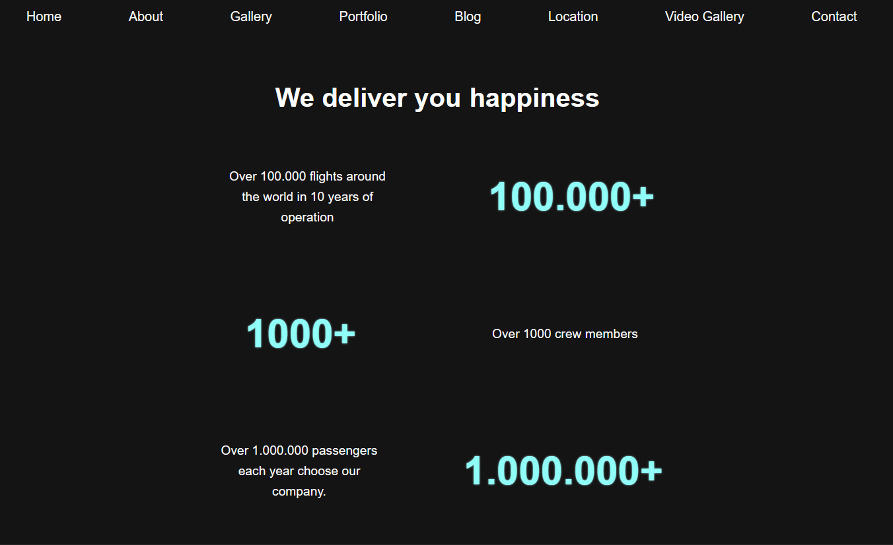
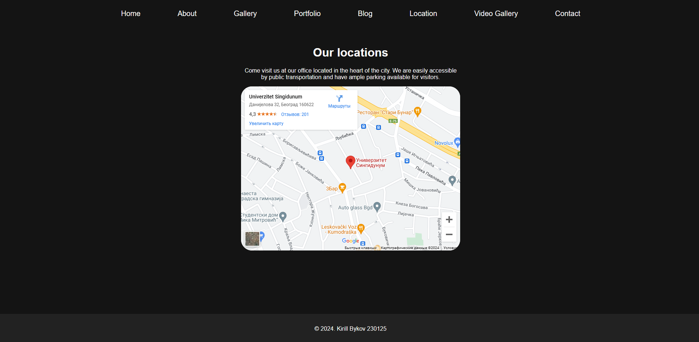
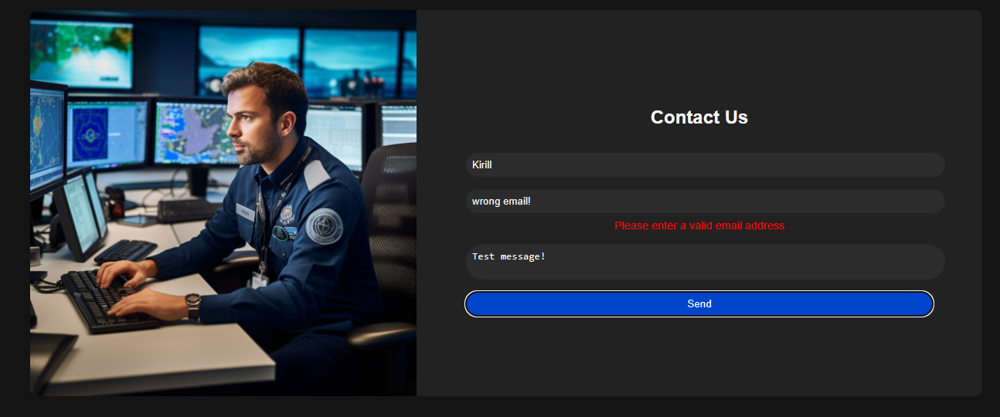

# Project Documentation

## Table of Contents
- [Project Documentation](#project-documentation)
  - [Table of Contents](#table-of-contents)
  - [Introduction](#introduction)
  - [Home Page](#home-page)
    - [Description](#description)
    - [Screenshot](#screenshot)
  - [About Us Page](#about-us-page)
    - [Description](#description-1)
    - [Screenshot](#screenshot-1)
  - [Gallery Page](#gallery-page)
    - [Description](#description-2)
    - [Screenshot](#screenshot-2)
  - [Video Gallery Page](#video-gallery-page)
    - [Description](#description-3)
    - [Screenshot](#screenshot-3)
  - [Contact Page](#contact-page)
    - [Description](#description-4)
    - [Screenshot](#screenshot-4)
  - [Portfolio Page](#portfolio-page)
    - [Description](#description-5)
    - [Screenshot](#screenshot-5)
  - [Blog Page](#blog-page)
    - [Description](#description-6)
    - [Screenshot](#screenshot-6)
  - [Location Page](#location-page)
    - [Description](#description-7)
    - [Screenshot](#screenshot-7)
  - [Functionality and Usage](#functionality-and-usage)
    - [Form Validation](#form-validation)
      - [Description](#description-8)
      - [Screenshot](#screenshot-8)
    - [Animated Elements](#animated-elements)
      - [Description](#description-9)
    - [Dynamic Content](#dynamic-content)
      - [Description](#description-10)

## Introduction

This document provides a comprehensive overview of the website project, including screenshots of each page and descriptions of all implemented functionalities.

## Home Page

### Description
The Home Page allows users to search for flights and hotels, featuring a header and a destination section.

It contains slidable row of popular destinations and the weather checking functionality.

### Screenshot

## About Us Page

### Description
The About Us page provides information about the team and company. It includes animated text and images.

### Screenshot

## Gallery Page

### Description
The Gallery page displays a collection of images with descriptions. Images and text are animated.

### Screenshot

## Video Gallery Page

### Description
The Video Gallery page showcases various videos with descriptions. Videos are presented with a similar layout to the image gallery.

### Screenshot

## Contact Page

### Description
The Contact page includes a form for users to get in touch. It features form validation and an animated layout.

### Screenshot

## Portfolio Page

### Description
The Portfolio page highlights different projects with images and descriptions in a grid layout.

### Screenshot

## Blog Page

### Description
The Blog page lists several blog articles with images, publication dates, and titles.

### Screenshot

## Location Page

### Description
The Location page displays a map and a text block describing the location of the office.

### Screenshot

## Functionality and Usage

### Form Validation

#### Description
Form validation ensures that all required fields are filled out correctly before submission. This includes checks for name, email, and message fields.

#### Screenshot

### Animated Elements

#### Description
Various elements across the website have animations that trigger when they come into view. This includes images, text, and sections.

### Dynamic Content

#### Description
The website includes dynamic content, such as the list of destinations that can be updated easily.

Every string asset can be easily edited by modifying `stringAssets` in the `main.js` file.